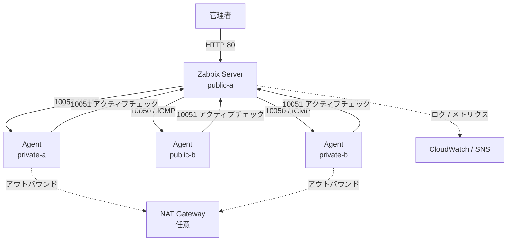

# AWS上のZabbix 7.0監視ラボ（Terraform）

[](https://github.com/ABFishyang/terraform-zbx-lab/actions/workflows/terraform.yml)

Amazon Linux 2023 上の Zabbix 7.0 監視ラボ構成をコード化した Terraform プロジェクトです。VPC、4つのサブネット、NAT Gateway、セキュリティグループ、IAM、EC2、CloudWatch Logs、メモリ・ディスク使用率アラームをモジュール単位で管理します。

> このリポジトリは学習・検証用途です。デフォルトでは NAT Gateway、EC2、CloudWatch 監視リソースを作成しません。

## 検証状況

| 確認項目 | 状態 |
|---|---|
| `terraform fmt -check -recursive` | CIで確認済み |
| `terraform validate` | CIで確認済み |
| TFLint | CIで確認済み |
| terraform-docs同期 | CIで確認済み |
| `terraform plan` | 未実施 |
| `terraform apply` / Zabbix動作確認 | 未実施 |

## 構成図



- Publicサブネット: Internet Gateway経由でインターネットへ接続
- Privateサブネット: 1台のNAT Gateway経由でアウトバウンド通信
- EC2管理: AWS Systems Manager Session Manager
- Zabbix Server: MariaDB、Apache/PHP、Zabbix Server、Zabbix Agent 2
- 監視対象ホスト: Zabbix Agent 2
- CloudWatch Agent: メモリ、ルートディスク、Apache/Zabbixログ

## セキュリティグループの通信経路

| 宛先 | プロトコル/ポート | 送信元 | 用途 |
|---|---:|---|---|
| Zabbix Server | TCP 80 | `admin_cidr`のみ | Webコンソール |
| Zabbix Server | TCP 10051 | Agent用SG | アクティブチェック/トラッパー |
| Agents | TCP 10050 | Server用SG | パッシブチェック |
| Agents | ICMP | Server用SG | 稼働確認 |

SSHポート22は開放せず、管理にはSession Managerを使用します。

## ディレクトリ構成

```text
.
├── main.tf
├── outputs.tf
├── providers.tf
├── variables.tf
├── versions.tf
├── terraform.tfvars.example
├── Makefile                    # init / fmt / validate / lint / docs / plan / apply / destroy
├── .tflint.hcl                 # tflint + tflint-ruleset-aws 設定
├── .terraform-docs.yml         # モジュール README 生成設定
├── .terraform-docs-root.yml    # ルート README 生成設定（Modules セクション込み）
├── modules
│   ├── network     (README.md 付き、versions.tf 付き)
│   ├── security    (README.md 付き、versions.tf 付き)
│   ├── iam         (README.md 付き、versions.tf 付き)
│   ├── compute     (README.md 付き、versions.tf 付き)
│   ├── monitoring  (README.md 付き、versions.tf 付き)
│   └── alarms      (README.md 付き、versions.tf 付き)
└── user_data
    ├── zabbix-server.sh.tftpl
    └── zabbix-agent.sh.tftpl
```

## Terraformリファレンス

各モジュールの詳細な入出力は `modules/<name>/README.md` を参照してください（`terraform-docs` で自動生成、Makefile の `make docs` で更新可能）。

ルートモジュールの入出力一覧:

<!-- BEGIN_TF_DOCS -->
## Requirements

| Name | Version |
| ---- | ------- |
| <a name="requirement_terraform"></a> [terraform](#requirement\_terraform) | >= 1.10.0, < 2.0.0 |
| <a name="requirement_aws"></a> [aws](#requirement\_aws) | ~> 6.0 |

## Providers

| Name | Version |
| ---- | ------- |
| <a name="provider_terraform"></a> [terraform](#provider\_terraform) | n/a |

## Modules

| Name | Source | Version |
| ---- | ------ | ------- |
| <a name="module_alarms"></a> [alarms](#module\_alarms) | ./modules/alarms | n/a |
| <a name="module_compute"></a> [compute](#module\_compute) | ./modules/compute | n/a |
| <a name="module_iam"></a> [iam](#module\_iam) | ./modules/iam | n/a |
| <a name="module_monitoring"></a> [monitoring](#module\_monitoring) | ./modules/monitoring | n/a |
| <a name="module_network"></a> [network](#module\_network) | ./modules/network | n/a |
| <a name="module_security"></a> [security](#module\_security) | ./modules/security | n/a |

## Resources

| Name | Type |
| ---- | ---- |
| [terraform_data.configuration_guard](https://registry.terraform.io/providers/hashicorp/terraform/latest/docs/resources/data) | resource |

## Inputs

| Name | Description | Type | Default | Required |
| ---- | ----------- | ---- | ------- | :------: |
| <a name="input_admin_cidr"></a> [admin\_cidr](#input\_admin\_cidr) | Administrator public IPv4 address in CIDR notation, for example 203.0.113.10/32 | `string` | n/a | yes |
| <a name="input_agent_instance_type"></a> [agent\_instance\_type](#input\_agent\_instance\_type) | EC2 instance type of each monitored host | `string` | `"t3.micro"` | no |
| <a name="input_agent_private_ips"></a> [agent\_private\_ips](#input\_agent\_private\_ips) | Private IPv4 addresses of the monitored hosts | `map(string)` | <pre>{<br/>  "private-a": "10.1.1.10",<br/>  "private-b": "10.1.3.10",<br/>  "public-b": "10.1.2.10"<br/>}</pre> | no |
| <a name="input_agent_root_volume_size"></a> [agent\_root\_volume\_size](#input\_agent\_root\_volume\_size) | Root volume size of each monitored host in GiB | `number` | `8` | no |
| <a name="input_alarm_email"></a> [alarm\_email](#input\_alarm\_email) | Optional email address subscribed to the SNS alarm topic | `string` | `null` | no |
| <a name="input_alarm_period_seconds"></a> [alarm\_period\_seconds](#input\_alarm\_period\_seconds) | CloudWatch alarm period in seconds | `number` | `60` | no |
| <a name="input_availability_zones"></a> [availability\_zones](#input\_availability\_zones) | Two availability zones used by the lab | `list(string)` | <pre>[<br/>  "ap-northeast-1a",<br/>  "ap-northeast-1c"<br/>]</pre> | no |
| <a name="input_aws_region"></a> [aws\_region](#input\_aws\_region) | AWS region used by this project | `string` | `"ap-northeast-1"` | no |
| <a name="input_create_ec2_instances"></a> [create\_ec2\_instances](#input\_create\_ec2\_instances) | Create the Zabbix server and three monitored EC2 instances | `bool` | `false` | no |
| <a name="input_datapoints_to_alarm"></a> [datapoints\_to\_alarm](#input\_datapoints\_to\_alarm) | Number of breaching periods required to enter ALARM state | `number` | `5` | no |
| <a name="input_disk_alarm_threshold"></a> [disk\_alarm\_threshold](#input\_disk\_alarm\_threshold) | Root disk usage alarm threshold in percent | `number` | `80` | no |
| <a name="input_enable_detailed_monitoring"></a> [enable\_detailed\_monitoring](#input\_enable\_detailed\_monitoring) | Enable EC2 one-minute detailed monitoring, which incurs charges | `bool` | `false` | no |
| <a name="input_enable_monitoring"></a> [enable\_monitoring](#input\_enable\_monitoring) | Create CloudWatch log groups, alarms, and an SNS topic | `bool` | `false` | no |
| <a name="input_enable_nat_gateway"></a> [enable\_nat\_gateway](#input\_enable\_nat\_gateway) | Create one NAT Gateway and an Elastic IP. This incurs hourly and data charges. | `bool` | `false` | no |
| <a name="input_evaluation_periods"></a> [evaluation\_periods](#input\_evaluation\_periods) | Number of periods evaluated by CloudWatch alarms | `number` | `5` | no |
| <a name="input_log_retention_days"></a> [log\_retention\_days](#input\_log\_retention\_days) | CloudWatch Logs retention period | `number` | `7` | no |
| <a name="input_memory_alarm_threshold"></a> [memory\_alarm\_threshold](#input\_memory\_alarm\_threshold) | Memory usage alarm threshold in percent | `number` | `80` | no |
| <a name="input_private_subnet_cidrs"></a> [private\_subnet\_cidrs](#input\_private\_subnet\_cidrs) | CIDRs of private-a and private-b | `list(string)` | <pre>[<br/>  "10.1.1.0/24",<br/>  "10.1.3.0/24"<br/>]</pre> | no |
| <a name="input_project_name"></a> [project\_name](#input\_project\_name) | Prefix used for resource names and tags | `string` | `"zbx-tf-lab"` | no |
| <a name="input_public_subnet_cidrs"></a> [public\_subnet\_cidrs](#input\_public\_subnet\_cidrs) | CIDRs of public-a and public-b | `list(string)` | <pre>[<br/>  "10.1.0.0/24",<br/>  "10.1.2.0/24"<br/>]</pre> | no |
| <a name="input_server_instance_type"></a> [server\_instance\_type](#input\_server\_instance\_type) | EC2 instance type of the Zabbix server | `string` | `"t3.small"` | no |
| <a name="input_server_private_ip"></a> [server\_private\_ip](#input\_server\_private\_ip) | Private IPv4 address of the Zabbix server | `string` | `"10.1.0.10"` | no |
| <a name="input_server_root_volume_size"></a> [server\_root\_volume\_size](#input\_server\_root\_volume\_size) | Root volume size of the Zabbix server in GiB | `number` | `20` | no |
| <a name="input_vpc_cidr"></a> [vpc\_cidr](#input\_vpc\_cidr) | IPv4 CIDR of the VPC | `string` | `"10.1.0.0/16"` | no |
| <a name="input_zabbix_db_password"></a> [zabbix\_db\_password](#input\_zabbix\_db\_password) | Password used by the local Zabbix MariaDB account | `string` | n/a | yes |

## Outputs

| Name | Description |
| ---- | ----------- |
| <a name="output_agent_instance_ids"></a> [agent\_instance\_ids](#output\_agent\_instance\_ids) | Map of monitored-host instance IDs |
| <a name="output_agent_private_ips"></a> [agent\_private\_ips](#output\_agent\_private\_ips) | Map of monitored-host private IPv4 addresses |
| <a name="output_agent_public_ips"></a> [agent\_public\_ips](#output\_agent\_public\_ips) | Map of monitored-host public IPv4 addresses |
| <a name="output_agent_security_group_id"></a> [agent\_security\_group\_id](#output\_agent\_security\_group\_id) | ID of the monitored-host security group |
| <a name="output_ami_id"></a> [ami\_id](#output\_ami\_id) | Resolved Amazon Linux 2023 AMI ID |
| <a name="output_cloudwatch_log_group_names"></a> [cloudwatch\_log\_group\_names](#output\_cloudwatch\_log\_group\_names) | Map of CloudWatch log group names |
| <a name="output_disk_alarm_name"></a> [disk\_alarm\_name](#output\_disk\_alarm\_name) | Name of the disk usage alarm, or null when disabled |
| <a name="output_iam_role_name"></a> [iam\_role\_name](#output\_iam\_role\_name) | Name of the EC2 IAM role |
| <a name="output_instance_profile_name"></a> [instance\_profile\_name](#output\_instance\_profile\_name) | Name of the EC2 instance profile |
| <a name="output_memory_alarm_name"></a> [memory\_alarm\_name](#output\_memory\_alarm\_name) | Name of the memory usage alarm, or null when disabled |
| <a name="output_nat_gateway_id"></a> [nat\_gateway\_id](#output\_nat\_gateway\_id) | NAT Gateway ID, or null when disabled |
| <a name="output_private_route_table_ids"></a> [private\_route\_table\_ids](#output\_private\_route\_table\_ids) | Map of private route table IDs |
| <a name="output_private_subnet_ids"></a> [private\_subnet\_ids](#output\_private\_subnet\_ids) | Map of private subnet IDs |
| <a name="output_public_route_table_id"></a> [public\_route\_table\_id](#output\_public\_route\_table\_id) | ID of the public route table |
| <a name="output_public_subnet_ids"></a> [public\_subnet\_ids](#output\_public\_subnet\_ids) | Map of public subnet IDs |
| <a name="output_server_instance_id"></a> [server\_instance\_id](#output\_server\_instance\_id) | Zabbix server instance ID, or null when disabled |
| <a name="output_server_private_ip"></a> [server\_private\_ip](#output\_server\_private\_ip) | Zabbix server private IPv4 address, or null when disabled |
| <a name="output_server_public_ip"></a> [server\_public\_ip](#output\_server\_public\_ip) | Zabbix server public IPv4 address, or null when disabled |
| <a name="output_server_security_group_id"></a> [server\_security\_group\_id](#output\_server\_security\_group\_id) | ID of the Zabbix server security group |
| <a name="output_sns_topic_arn"></a> [sns\_topic\_arn](#output\_sns\_topic\_arn) | SNS alert topic ARN, or null when disabled |
| <a name="output_vpc_id"></a> [vpc\_id](#output\_vpc\_id) | ID of the VPC |
| <a name="output_zabbix_web_url"></a> [zabbix\_web\_url](#output\_zabbix\_web\_url) | URL of the Zabbix web interface, or null when disabled |
<!-- END_TF_DOCS -->

## 前提条件

- Terraform 1.10以降
- AWS CLI v2
- 本プロジェクトのリソースを作成できるAWS権限
- リポジトリ外で設定したAWS CLI認証情報

plan実行前に、利用中のAWS Identityを確認します。

```powershell
aws sts get-caller-identity
```

## 設定

変数ファイルのサンプルをコピーします。

```powershell
Copy-Item .\terraform.tfvars.example .\terraform.tfvars
```

現在のパブリックIPv4アドレスを確認します。

```powershell
(Invoke-RestMethod -Uri "https://checkip.amazonaws.com").Trim()
```

`terraform.tfvars` を編集し、2つのサンプル値を置き換えます。

```hcl
admin_cidr        = "YOUR_PUBLIC_IP/32"
zabbix_db_password = "A_PRIVATE_PASSWORD"
```

`terraform.tfvars` は `.gitignore` の対象です。パスワード、アクセスキー、stateファイル、保存済みplanファイルはコミットしないでください。

## 安全な検証手順

サンプル設定では、課金が発生する主なコンポーネントを無効にしています。

```hcl
enable_nat_gateway   = false
create_ec2_instances = false
enable_monitoring    = false
```

次のコマンドを実行します。

```powershell
terraform init
terraform fmt -recursive
terraform validate
terraform plan -out=tfplan
```

planの内容をすべて確認し、リソース数と設定を理解するまではapplyしないでください。

## 静的解析とドキュメント

静的解析には [tflint](https://github.com/terraform-linters/tflint)（`aws` ruleset）、各モジュールのREADME同期には [terraform-docs](https://github.com/terraform-docs/terraform-docs) を使用します。pushおよびpull requestのたびにCI（`.github/workflows/terraform.yml`）で実行されます。

```bash
# 初回のみ: .tflint.hclで指定したプラグインを取得
make lint-init

# 静的解析（CIのlintジョブと同じ）
make lint

# モジュールREADMEとルートREADMEのTerraformリファレンスを再生成
make docs
```

**Windows向け補足:** 標準のGit Bashには `make` が含まれていません。`choco install make` または `scoop install make` で導入するか、次のコマンドを直接実行してください。

```powershell
tflint --init                                    # 初回のみ
tflint --recursive --format compact              # 静的解析
terraform-docs -c .terraform-docs.yml modules/network   # モジュールREADMEを再生成
terraform-docs -c .terraform-docs-root.yml .             # ルートREADMEを再生成
```

モジュールの `variables.tf` または `outputs.tf` を変更した場合は、push前に `make docs`（または上記コマンド）を実行してください。未実行の場合、CIの `docs` ジョブが差分を検知します。

## ラボ全体のデプロイ

Privateサブネットのインスタンスは、初期構築時にアウトバウンド通信が必要です。`terraform.tfvars` で次の3項目を有効にします。

```hcl
enable_nat_gateway   = true
create_ec2_instances = true
enable_monitoring    = true
```

必要に応じてメール通知を設定します。

```hcl
alarm_email = "your-address@example.com"
```

新しいplanを作成し、内容を確認してapplyします。

```powershell
terraform plan -out=tfplan
terraform apply tfplan
```

メールアドレスを設定した場合は、AWSから届くメールでSNSサブスクリプションを承認してください。

EC2のUser Data実行完了後、ZabbixのURLを取得します。

```powershell
terraform output -raw zabbix_web_url
```

初期構築ログはSession Managerでサーバーへ接続して確認できます。

```bash
sudo tail -f /var/log/user-data-zabbix-server.log
```

## CloudWatchメトリクスとログ

カスタムメトリクスは `CWAgent` namespaceを使用します。

- `mem_used_percent`
- `disk_used_percent` with `path=/` and `fstype=xfs`

ロググループ:

- `/<project_name>/zabbix-server/httpd/access`
- `/<project_name>/zabbix-server/httpd/error`
- `/<project_name>/zabbix-server/zabbix/server`

Zabbix Serverには、デフォルト閾値80%で2つのアラームを作成します。

- メモリ使用率
- ルートディスク使用率

## コスト管理

主に次のリソースで料金が発生します。

- NAT Gatewayとデータ処理
- EC2インスタンス
- EBSボリューム
- パブリックIPv4アドレス
- EC2詳細モニタリング（有効時）
- CloudWatchカスタムメトリクス、ログ、アラーム
- SNS通知

ネットワークを残して課金対象を停止する場合は、3つのスイッチを `false` に変更し、`terraform plan` で削除対象を確認してからapplyします。すべて削除する場合は次を実行します。

```powershell
terraform plan -destroy -out=destroy.tfplan
terraform apply destroy.tfplan
```

## 重要な制約

- 実AWS環境への `terraform plan` / `apply` とZabbixの機能試験はまだ行っていません。
- コストを抑えるためNAT Gatewayは1台のみです。本番向けのマルチAZアウトバウンド構成ではありません。
- MariaDBはZabbix ServerのEC2上で稼働します。本番環境ではバックアップを備えたマネージドデータベースを検討してください。
- HTTP接続元は管理者IPのみに制限していますが、通信は暗号化されません。本番環境ではHTTPSと適切なIngress設計が必要です。
- DBパスワードはEC2 User DataとTerraform stateに保存されます。stateを安全に管理し、本番環境ではSecrets ManagerまたはSSM Parameter Storeを検討してください。
- plan時点で最新のAmazon Linux 2023 AMIを取得しますが、新AMIの公開だけを理由に既存インスタンスが自動置換されないライフサイクル設定です。

## ライセンス

MIT Licenseです。詳細は [LICENSE](LICENSE) を参照してください。
